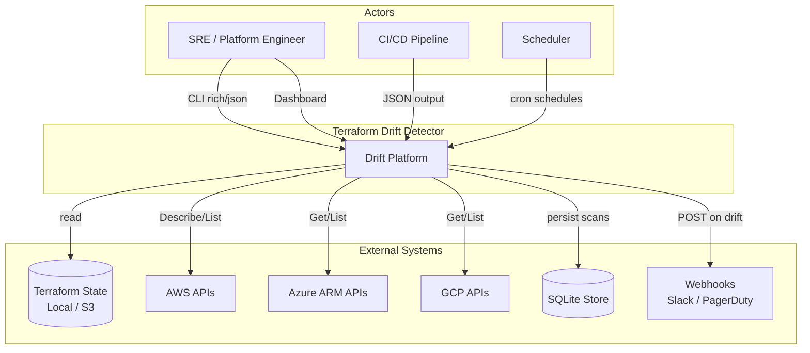
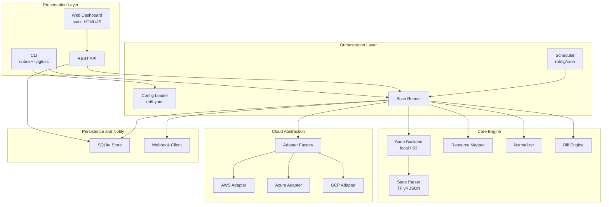
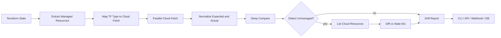
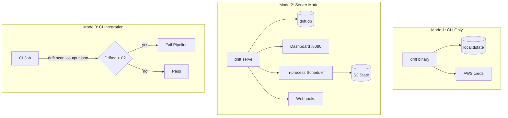
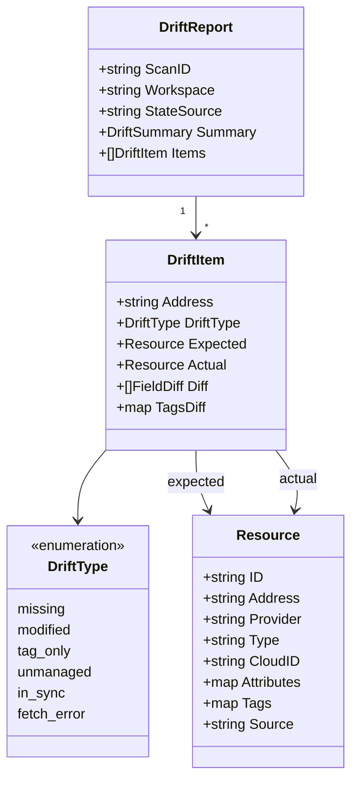
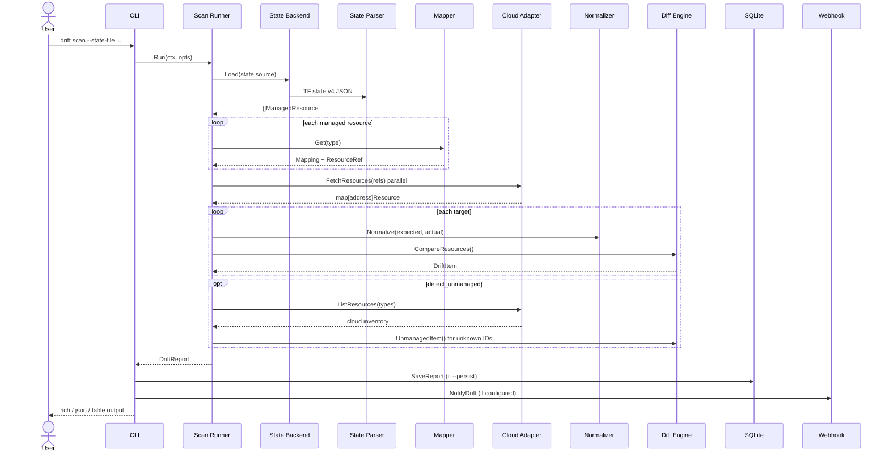
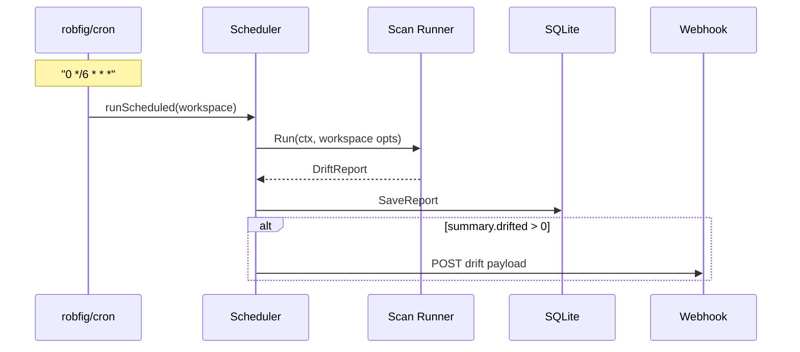
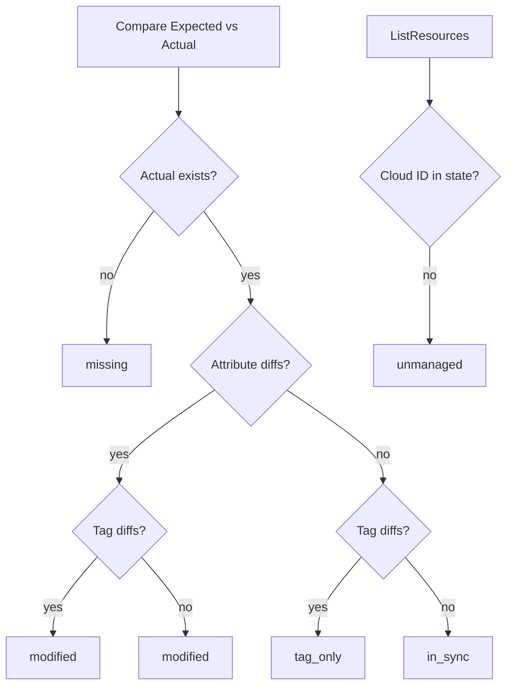
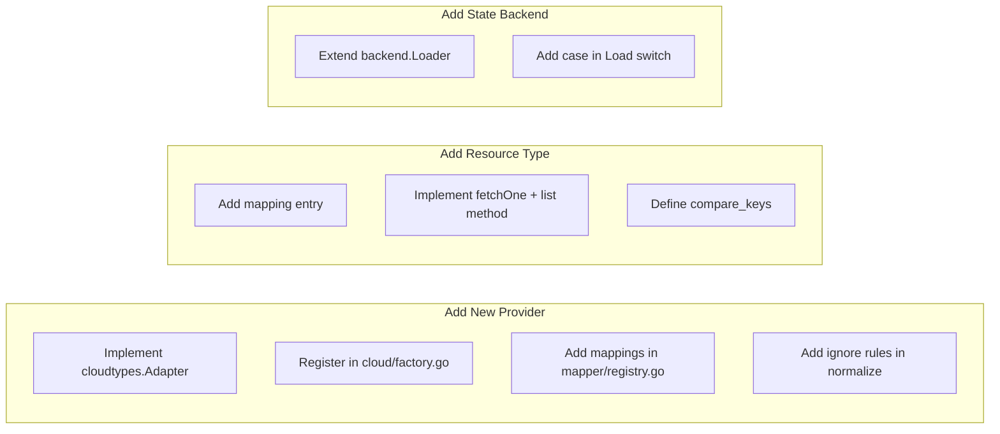
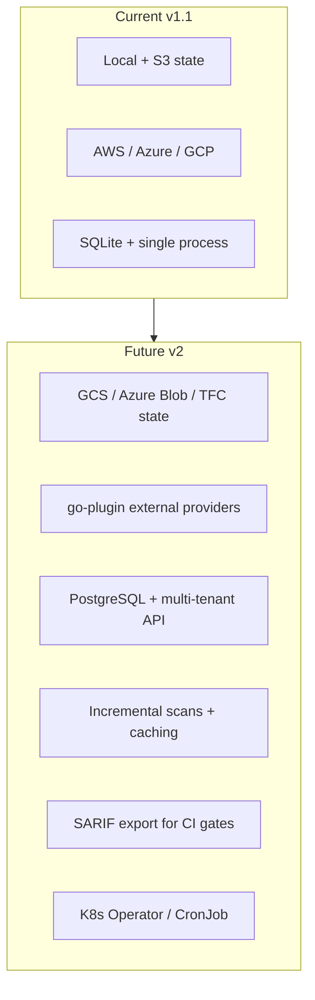

# Terraform Drift Detector — Architecture

This document describes the **High-Level Design (HLD)** and **Low-Level Design (LLD)** for the Terraform Drift Detector platform.

---

## 1. Design Philosophy

The system follows a **read-only reconciliation** pattern:

```
Expected (Terraform State)  vs  Actual (Cloud APIs)  →  Normalized Diff  →  Drift Report
```

It deliberately avoids `terraform plan` / `terraform apply`. Instead it:

1. Treats Terraform state as the **source of truth for intent**
2. Fetches **live metadata** from cloud provider APIs
3. Normalizes both sides into a **canonical resource model**
4. Produces structured drift with no mutation of infrastructure

---

## 2. High-Level Design (HLD)

### 2.1 System Context (C4 — Level 1)



### 2.2 Container Diagram (C4 — Level 2)



### 2.3 Logical Data Flow



### 2.4 Deployment Topology



---

## 3. Low-Level Design (LLD)

### 3.1 Package Architecture

```
cmd/drift/                    Entry point
├── internal/
│   ├── cli/                  Commands, rich output, UI
│   ├── config/               drift.yaml loader
│   ├── models/               Domain types (Resource, DriftReport)
│   ├── state/                TF state v4 parser
│   │   └── backend/          local + S3 loaders
│   ├── mapper/               TF type → fetch strategy registry
│   ├── cloudtypes/           Adapter interface + MockAdapter
│   ├── cloud/                Adapter factory (aws/azure/gcp)
│   ├── providers/
│   │   ├── aws/              EC2, S3 SDK
│   │   ├── azure/            ARM SDK
│   │   └── gcp/              Compute + Storage SDK
│   ├── normalize/            Attribute filtering and coercion
│   ├── diff/                 Comparison and classification
│   ├── scan/                 Scan orchestration
│   ├── scheduler/            Cron job runner
│   ├── notify/               Webhook dispatcher
│   ├── store/                SQLite persistence
│   └── api/                  HTTP handlers
└── web/                      Dashboard static assets
```

### 3.2 Core Interface — Cloud Adapter

The extensibility boundary lives in `internal/cloudtypes`:

```go
type Adapter interface {
    Name() string
    FetchResource(ctx, ref) (*Resource, error)
    FetchResources(ctx, refs) (map[string]*Resource, error)   // parallel
    ListResources(ctx, types, opts) ([]*Resource, error)        // unmanaged
}
```

| Method | Purpose |
|--------|---------|
| `FetchResources` | Point lookups for state-managed resources |
| `ListResources` | Inventory scan for unmanaged detection |

Factory (`internal/cloud`) selects the adapter by provider:

| Provider | SDK |
|----------|-----|
| `aws` | AWS SDK (EC2, S3) |
| `azure` | ARM SDK (Resources, Network, Storage) |
| `gcp` | Google API (Compute, Storage) |

### 3.3 Resource Mapping Registry

Each Terraform type maps to a fetch strategy in `internal/mapper/registry.go`:

```yaml
aws_instance:
  provider: aws
  id_attribute: id
  compare_keys: [instance_type, ami, subnet_id, vpc_security_group_ids]
```

Flow:

```
state.ManagedResource
    → mapper.ToResourceRef()           # extract cloud ID
    → adapter.FetchResources()         # live fetch
    → normalize.NormalizeResource()    # both sides
    → diff.CompareResources()          # classify drift
```

### 3.4 Canonical Domain Model



### 3.5 Scan Sequence (On-Demand)



### 3.6 Scheduled Scan Sequence



### 3.7 Normalization Pipeline

Computed and read-only Terraform attributes are stripped before comparison:

```
Raw State Attributes
    → filter by compare_keys (per resource type)
    → apply DefaultIgnoreRules (arn, tags_all, id, ...)
    → coerce types (float→int, sort slices)
    → strip tags (compared separately)
    → Normalized Resource
```

Tag comparison is isolated so drift can be classified as `tag_only` vs `modified`.

### 3.8 Drift Classification Logic



---

## 4. Component Deep Dive

### 4.1 State Ingestion Layer

| Backend | Implementation | Source |
|---------|----------------|--------|
| Local | `state.LoadFromFile()` | `--state-file` |
| S3 | AWS S3 `GetObject` | `--state-bucket` + `--state-key` |

Parser rules:

- Only `mode: managed` resources
- Skips `data.*` sources
- Resolves provider aliases (`registry.terraform.io/hashicorp/aws` → `aws`)
- Builds addresses including module prefixes

### 4.2 Cloud Adapter Layer

| Provider | SDK | Fetch | List (unmanaged) |
|----------|-----|-------|------------------|
| AWS | aws-sdk-go-v2 | DescribeInstances, HeadBucket, DescribeSecurityGroups | Describe*, ListBuckets |
| Azure | azure-sdk-for-go | ResourceGroups.Get, VNets.Get | List Pagers |
| GCP | cloud.google.com/go | Instances.Get, Buckets.Attrs | Buckets iterator, Networks.List |

Auth uses standard credential chains (env vars, IAM roles, workload identity, `azidentity`, ADC).

### 4.3 Supported Resource Types

| Provider | Terraform Types |
|----------|-----------------|
| AWS | `aws_instance`, `aws_s3_bucket`, `aws_security_group`, `aws_vpc`, `aws_subnet` |
| Azure | `azurerm_resource_group`, `azurerm_virtual_network`, `azurerm_subnet`, `azurerm_storage_account` |
| GCP | `google_compute_instance`, `google_storage_bucket`, `google_compute_network` |

### 4.4 Persistence Layer

SQLite schema (simplified):

```sql
CREATE TABLE scans (
    scan_id       TEXT PRIMARY KEY,
    workspace     TEXT NOT NULL,
    state_source  TEXT NOT NULL,
    provider      TEXT NOT NULL,
    region        TEXT,
    started_at    TEXT NOT NULL,
    finished_at   TEXT NOT NULL,
    duration      TEXT NOT NULL,
    summary_json  TEXT NOT NULL,
    report_json   TEXT NOT NULL
);
```

Enables scan history, dashboard trends, and `drift report list/show`.

### 4.5 Notification Layer

Webhook payload on drift:

```json
{
  "event": "drift.detected",
  "scan_id": "...",
  "workspace": "prod",
  "summary": { "drifted": 3, "missing": 1, "modified": 2 },
  "drifted_items": []
}
```

Fires only when `summary.drifted > 0` and `on_drift: true` in config.

---

## 5. API Surface

| Method | Path | Description |
|--------|------|-------------|
| GET | `/api/v1/scans` | List scan metadata |
| POST | `/api/v1/scans` | Trigger workspace scan |
| GET | `/api/v1/scans/{id}` | Full drift report |
| GET | `/api/v1/scans/{id}/json` | JSON download |
| GET | `/api/v1/workspaces` | Configured workspaces |
| GET | `/` | Dashboard static files |

---

## 6. Configuration Model

```yaml
server:
  port: 8080
  database: ./drift.db

webhooks:
  - url: https://hooks.slack.com/services/...
    on_drift: true

workspaces:
  - name: prod
    provider: aws
    region: us-east-1
    detect_unmanaged: true
    state:
      type: s3
      bucket: my-tf-state
      key: prod/terraform.tfstate
      region: us-east-1

schedules:
  - workspace: prod
    cron: "0 */6 * * *"

drift:
  detect_unmanaged: false
  concurrency: 10
  ignore_rules:
    - tags_all
```

See [`configs/examples/drift.yaml`](configs/examples/drift.yaml) for a full example.

---

## 7. Extensibility Model



No changes to the diff engine or CLI are required for new resource types — only mapping and adapter methods.

---

## 8. Non-Functional Characteristics

| Concern | Approach |
|---------|----------|
| **Performance** | Parallel `FetchResources` per resource (goroutines) |
| **Safety** | Read-only cloud API calls; no mutations |
| **Portability** | Single Go binary; SQLite embedded |
| **Observability** | Structured JSON reports; webhook events |
| **False positives** | Default ignore lists + per-type `compare_keys` |
| **Partial failure** | Per-resource `fetch_error`; scan continues |
| **Multi-tenancy** | Workspace abstraction in config (v1: single-process) |

---

## 9. Architecture Comparison

| Capability | `terraform plan` | Terraform Cloud Drift | Drift Detector |
|------------|------------------|----------------------|----------------|
| Needs TF binary | Yes | Yes (managed) | **No** |
| Needs provider plugins | Yes | Yes | **No** |
| Multi-cloud single tool | Via TF | Via TF | **Native adapters** |
| Unmanaged detection | No | Limited | **Yes** |
| Custom scheduling | Manual | TFC schedules | **Built-in cron** |
| CI-friendly JSON | Plan output | API | **Native JSON/rich CLI** |

---

## 10. Future Architecture (Roadmap)



---

## 11. One-Page Summary

```
┌─────────────────────────────────────────────────────────────────────┐
│                     TERRAFORM DRIFT DETECTOR                        │
├─────────────────────────────────────────────────────────────────────┤
│  INPUTS          │  CORE PIPELINE           │  OUTPUTS              │
│  ───────         │  ─────────────           │  ───────              │
│  TF State v4     │  Parse → Map → Fetch     │  Rich CLI             │
│  (local/S3)      │  → Normalize → Diff      │  JSON / Table         │
│  drift.yaml      │  → Classify → Report       │  REST API             │
│  Cloud creds     │                            │  Dashboard            │
│                  │                            │  Webhooks             │
│                  │                            │  SQLite history       │
├─────────────────────────────────────────────────────────────────────┤
│  CLOUDS: AWS · Azure · GCP    │    DRIFT: missing · modified ·     │
│                               │    tag_only · unmanaged · in_sync   │
└─────────────────────────────────────────────────────────────────────┘
```

---

## Related Documentation

- [README.md](README.md) — Quick start and usage
- [configs/examples/drift.yaml](configs/examples/drift.yaml) — Configuration reference
